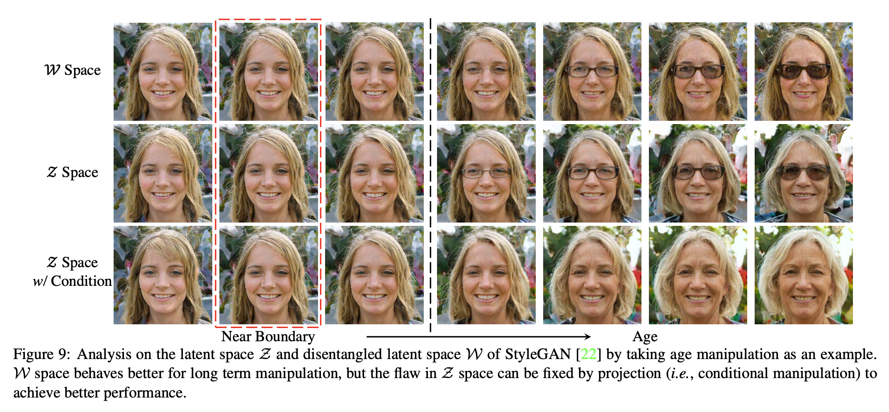

# InterFaceGAN Latent Space Analysis

[](https://colab.research.google.com/github/citypooh/InterFaceGAN_Latent_Space_Analysis/blob/main/InterFaceGAN_Analysis.ipynb)
[](https://www.python.org/)
[](https://pytorch.org/)
[](https://arxiv.org/abs/1907.10786)

A study of how semantic information is organized in GAN latent spaces, reproducing and testing the
central disentanglement claim of **InterFaceGAN** (Shen et al., CVPR 2020): that StyleGAN's
intermediate $\mathcal{W}$ space separates facial attributes more cleanly than its input
$\mathcal{Z}$ space.

**Course:** CS-GY 6923 Machine Learning (Spring 2025), NYU Tandon
**Team:** David Hong · Seongjae Jung

> This is a paper analysis and reproduction project, not original research. The generator code and
> pre-computed boundaries come from the authors' [official implementation](https://github.com/genforce/interfacegan);
> the analysis, experiments, and write-up in the notebook are ours. See [Attribution](#attribution).

---

## The Question

GANs generate strikingly realistic faces, but a latent code is just an opaque vector — there is no
"make this person older" dial. InterFaceGAN's insight is that you do not need one, because the
semantics are already there in linear form: for any binary facial attribute, the latent codes that
produce faces with it and without it turn out to be separable by a **hyperplane**.

Train a linear SVM on labelled samples, take the unit normal $\mathbf{n}$ of the resulting boundary,
and editing becomes vector arithmetic:

$$\mathbf{z}' = \mathbf{z} + \alpha \mathbf{n}$$

where $\alpha$ controls the strength and sign of the edit. Nothing about the generator is retrained
or modified.

StyleGAN complicates this pleasantly by offering two latent spaces: the input $\mathcal{Z}$, which is
constrained to a standard normal, and $\mathcal{W}$, produced by passing $\mathbf{z}$ through a
learned mapping network. **The claim we set out to examine is that $\mathcal{W}$ disentangles
attributes better than $\mathcal{Z}$, and that the gap widens as edits get more aggressive.**

---

## Evidence



<sub>Figure 9 from Shen et al., *Interpreting the Latent Space of GANs for Semantic Face Editing*
(CVPR 2020), reproduced here for discussion.</sub>

This single figure carries most of the argument. All three rows apply the same age edit, pushing
further from the boundary left to right.

Near the boundary (the red box) all three spaces behave identically — small edits are easy anywhere.
The interesting behaviour is at distance. In $\mathcal{Z}$ space the aging edit drags **eyeglasses**
along with it: by the rightmost column the subject has acquired sunglasses that nobody asked for.
That is entanglement — the age and eyeglasses directions are correlated in $\mathcal{Z}$, so moving
along one moves along the other. In $\mathcal{W}$ space the same edit is cleaner for longer, though
it eventually picks up glasses too.

The bottom row is the counterpoint that keeps the story honest: $\mathcal{Z}$ space's flaw is
**fixable**. Projecting the age direction to be orthogonal to the eyeglasses direction — conditional
manipulation — produces a clean aging sequence in $\mathcal{Z}$ space with no glasses at all. So
$\mathcal{W}$ is better by default, not better in principle.

---

## What the Notebook Does

The [notebook](InterFaceGAN_Analysis.ipynb) is organized as a written report around a working demo.

**Interactive editing.** Load one of three pre-trained generators (`pggan_celebahq`,
`stylegan_celebahq`, `stylegan_ffhq`), sample latent codes with a fixed seed, and manipulate five
attributes — age, eyeglasses, gender, pose, smile — with sliders spanning $\alpha \in [-3, 3]$. For
StyleGAN the latent space is switchable between $\mathcal{Z}$ and $\mathcal{W}$, which is what makes
the side-by-side comparison possible: identical seed, identical edit, different space.

**Write-up.** Five sections covering the method and how it compares to prior attribute-control
approaches, the main claim and the evidence for it, the demo and interpretation, attribution, and a
critical reflection on what held up and what did not.

> **One caveat on reading the notebook.** Section B contains a table of LPIPS and identity-similarity
> figures that are **illustrative, not measured** — hand-entered values chosen to be directionally
> consistent with the published qualitative findings. Nothing in the notebook computes those metrics.
> This is flagged in the notebook itself, both above and below the table. The real evidence here is
> visual.

---

## Findings

**Linearity holds, and that is the surprising part.** A non-linear generator of tens of millions of
parameters encodes "age" as a direction you can find with a linear SVM. The intuition that a complex
mapping demands a complex manipulation technique simply does not hold.

**$\mathcal{W}$ wins on default behaviour, not on ceiling.** $\mathcal{W}$ preserves identity and
attribute specificity further from the boundary, which matches the claim. But conditional
manipulation closes most of the gap in $\mathcal{Z}$, so the honest framing is that the mapping
network buys you disentanglement for free rather than disentanglement you cannot otherwise get.

**Entanglement is a property of the attribute pair, not the space.** Age and eyeglasses are coupled
because the training distribution couples them — older faces in CelebA-HQ and FFHQ wear glasses more
often. No latent space can fully undo a correlation the data put there; projection just lets you
route around it.

---

## Limitations

- **Evaluation is visual.** The paper leans on qualitative comparison, and so does this analysis. A
  proper study would compute identity similarity and attribute classifier scores across a sweep of
  $\alpha$ — that is the obvious next step and the main thing missing here.
- **Boundaries are not perfectly disentangled.** Even in $\mathcal{W}$, large edits leak into other
  attributes.
- **Extreme $\alpha$ breaks realism.** Push far enough past the data manifold and the generator
  produces artifacts.
- **Dependent on expensive pre-trained models.** The method interprets a GAN; it cannot rescue a bad
  one, and training these generators is far beyond a course project's budget.
- **Environment fragility.** The reference implementation pins older library versions and downloads
  checkpoints from Dropbox, which was the single biggest practical obstacle in getting the
  reproduction to run.

---

## Running It

The notebook is written for **Google Colab with a GPU runtime** — click the badge at the top.

It clones the reference implementation and pulls three pre-trained checkpoints on first run:

```python
!git clone https://github.com/genforce/interfacegan.git
!wget https://www.dropbox.com/s/t74z87pk3cf8ny7/pggan_celebahq.pth?dl=1  -O models/pretrain/pggan_celebahq.pth
!wget https://www.dropbox.com/s/nmo2g3u0qt7x70m/stylegan_celebahq.pth?dl=1 -O models/pretrain/stylegan_celebahq.pth
!wget https://www.dropbox.com/s/qyv37eaobnow7fu/stylegan_ffhq.pth?dl=1   -O models/pretrain/stylegan_ffhq.pth
```

Two notes on reproducing it as submitted. The cell that displays Figure 9 mounts Google Drive and
reads from a personal path; a copy of that figure lives in [`assets/`](assets) in this repository, so
point the cell there (or skip it — the image is embedded above). And if the Dropbox links have gone
stale, the checkpoints are also linked from the
[reference repository's README](https://github.com/genforce/interfacegan#pre-trained-models).

---

## Repository Structure

| Path | Description |
| --- | --- |
| [`InterFaceGAN_Analysis.ipynb`](InterFaceGAN_Analysis.ipynb) | Main notebook — interactive editing demo plus the full written analysis |
| [`docs/InterFaceGAN_Analysis.pdf`](docs/InterFaceGAN_Analysis.pdf) | Rendered notebook, in case the `.ipynb` does not display |
| [`docs/Project_Proposal.pdf`](docs/Project_Proposal.pdf) | Project proposal |
| [`assets/paper_figure9_z_vs_w.png`](assets/paper_figure9_z_vs_w.png) | Figure 9 from the paper, referenced by the notebook |

The reference implementation is intentionally **not** vendored here — the notebook clones it at
runtime from [genforce/interfacegan](https://github.com/genforce/interfacegan).

---

## Attribution

This project analyzes and demonstrates existing work. Credit belongs as follows.

**Method and code** — Shen, Y., Gu, J., Tang, X., & Zhou, B. (2020). *Interpreting the Latent Space
of GANs for Semantic Face Editing.* CVPR 2020. [arXiv:1907.10786](https://arxiv.org/abs/1907.10786) ·
[genforce/interfacegan](https://github.com/genforce/interfacegan). The generators, the pre-computed
SVM boundaries, and the utility functions in the notebook are the authors'.

**Generators** — Karras, T., Aila, T., Laine, S., & Lehtinen, J. (2018). *Progressive Growing of GANs
for Improved Quality, Stability, and Variation.* ICLR 2018. · Karras, T., Laine, S., & Aila, T.
(2019). *A Style-Based Generator Architecture for Generative Adversarial Networks.* CVPR 2019.

**Data** — the generators were trained on CelebA-HQ and FFHQ.

**Ours** — the choice of claim to test, the comparison methodology, the interpretation of results,
and all written analysis in the notebook.
